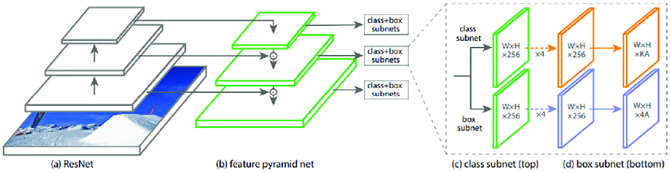
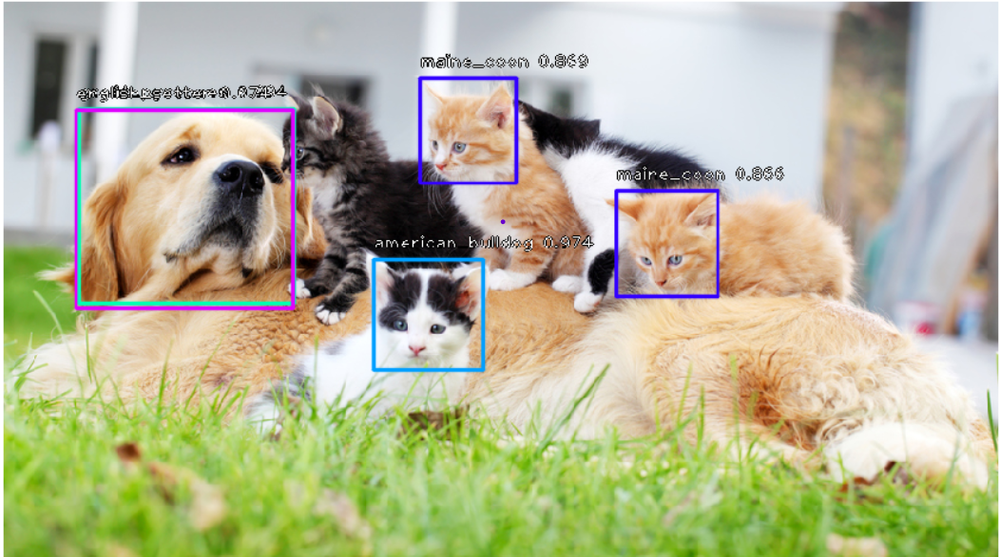
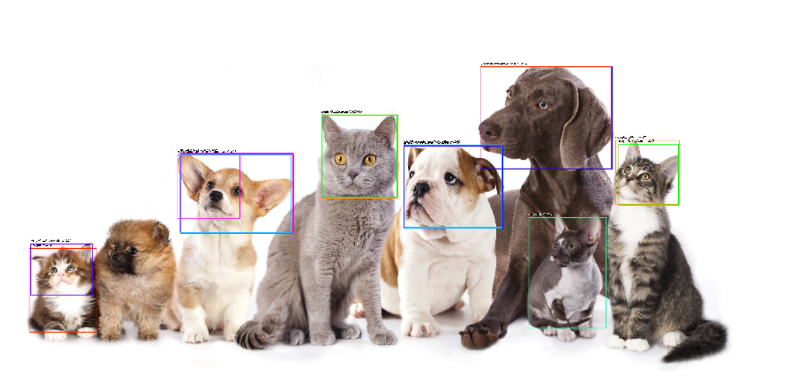

# Pet-face-recognition-Retinanet-keras
Pet face recognition using Retinanet with keras

## Dataset:
https://www.kaggle.com/tanlikesmath/the-oxfordiiit-pet-dataset
The Oxford-IIIT Pet Dataset is a 37 category pet dataset with roughly 200 images for each class created by the Visual Geometry Group at Oxford. The images have a large variations in scale, pose and lighting. All images have an associated ground truth annotation of breed, head ROI, and pixel level trimap segmentation.

## Model and Library:
RetinaNet is a single, unified network composed of a backbone network and two task-specific subnetworks. The backbone is responsible for computing a conv feature map over an entire input image and is an off-the-self convolution network. The first subnet performs classification on the backbones output; the second subnet performs convolution bounding box regression. I used this library: https://github.com/fizyr/keras-retinanet. It offers an implementation of RetinaNet in Keras framework. The network was pretrained on COCO Dataset.

## Results:

## Learn more:

Focal loss for object detection: [link to video](https://www.youtube.com/watch?v=44tlnmmt3h0&ab_channel=ComputerVisionFoundationVideos)
